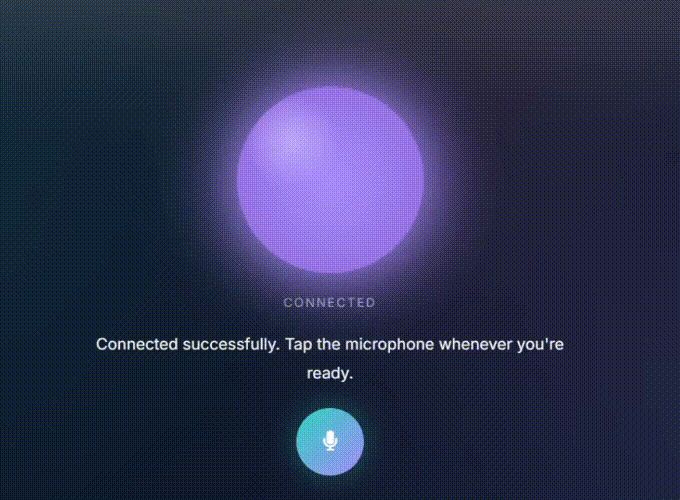

# MindAnchor

<p align="center">
  
</p>

<h2 align="center">Production-Grade AI Voice Companion for Emotional Wellness</h2>

<p align="center">
Natural, low-latency voice conversations powered by LiveKit, Deepgram, Gemini, and ElevenLabs.
</p>

<p align="center">
  
  
  
  
  
  
</p>

---

## The Problem

We live in a world where staying connected has never been easier, yet meaningful conversations have become increasingly rare. Busy schedules, demanding careers, geographical distance, and the constant pace of modern life often leave people with little opportunity to pause and simply talk.

Moments of stress, anxiety, self-doubt, or emotional exhaustion rarely arrive at convenient times. They often occur late at night, after a difficult meeting, during periods of loneliness, or when friends, family, or professional support may not be immediately available.

While AI has transformed productivity, education, and software engineering, its potential to provide compassionate, accessible conversational support remains largely untapped.

MindAnchor was born from one simple question:

> **What if AI could become a calm, empathetic companion that listens first, responds naturally, and helps people navigate difficult moments through meaningful conversation?**

---

## Overview

MindAnchor is a production-grade AI voice companion that enables natural, real-time spoken conversations for emotional wellness and guided mindfulness.

Instead of interacting through text, users simply speak naturally while MindAnchor listens, understands context, and responds with empathetic, human-like voice interactions.

The project combines modern speech recognition, large language models, neural speech synthesis, and low-latency voice streaming into a seamless conversational AI pipeline.

**MindAnchor is not intended to replace licensed mental health professionals or genuine human relationships. It is designed as an accessible conversational companion that provides supportive dialogue whenever immediate human interaction may not be available.**

---

## Key Features

- Real-time voice conversations
- Ultra-low latency speech streaming
- Human-like AI voice responses
- Natural speech recognition
- Guided mindfulness exercises
- Emotionally supportive conversations
- JWT authentication
- Production-grade architecture
- Modular FastAPI backend

---

## System Architecture

<p align="center">

</p>

---

## Demo

<p align="center">
<a href="assets/demo.mp4">

</a>
</p>

<p align="center">
<b>Click the GIF above to watch the complete demo.</b>
</p>

---

## Voice Pipeline

```text
🎤 User Speaks
      │
      ▼
LiveKit
      │
      ▼
Deepgram Speech-to-Text
      │
      ▼
Google Gemini
      │
      ▼
ElevenLabs Text-to-Speech
      │
      ▼
LiveKit
      │
      ▼
🔊 AI Voice Response
```

---

## Tech Stack

| Category | Technologies |
|-----------|--------------|
| Backend | FastAPI |
| Frontend | HTML5, CSS3, Vanilla JavaScript |
| Programming Languages | Python, JavaScript |
| Real-Time Communication | LiveKit, WebRTC |
| Speech-to-Text | Deepgram Nova |
| Large Language Model | Google Gemini |
| Text-to-Speech | ElevenLabs |
| Authentication | JWT |
| Configuration | python-dotenv |
| Development Tools | Git, GitHub, VS Code |

---

## Quick Start

### Clone Repository

```bash
git clone https://github.com/<your-username>/MindAnchor.git
cd MindAnchor
```

### Create Environment

```bash
conda create -n voice python=3.11
conda activate voice
```

### Install Dependencies

```bash
pip install -r requirements.txt
```

### Configure Environment Variables

Create a `.env` file.

```env
LIVEKIT_URL=
LIVEKIT_API_KEY=
LIVEKIT_API_SECRET=
DEEPGRAM_API_KEY=
ELEVENLABS_API_KEY=
GEMINI_API_KEY=
```

### Run the AI Worker

```bash
python app.py dev
```

### Run the Token Server

```bash
uvicorn token_server:app --reload
```

### Launch the Frontend

Open:

```text
frontend/index.html
```

Grant microphone access and begin speaking naturally with MindAnchor.

---

## Future Improvements

- Persistent conversation memory
- Personalized wellness profiles
- Emotion detection from voice
- Daily mindfulness sessions
- Multi-language support
- Voice cloning
- Conversation analytics dashboard

---

## License

This project is licensed under the **MIT License**.
