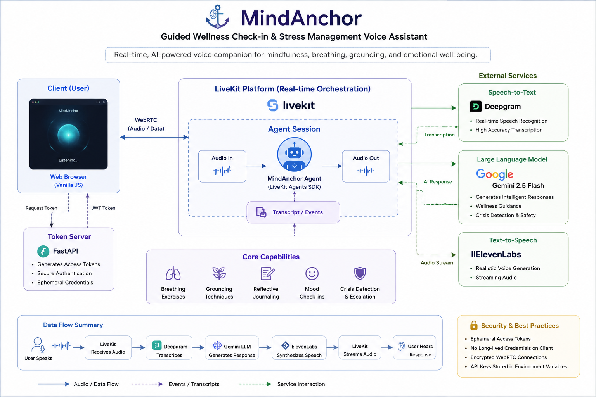

# MindAnchor

## The Problem Statement

We live in a world that has never been more connected, yet genuine human connection has become increasingly scarce. The pace of modern life, demanding careers, geographical separation, and the overwhelming presence of digital communication have contributed to a growing sense of loneliness and emotional isolation. While technology has enabled us to communicate instantly, meaningful conversations—those where we feel truly heard, understood, and supported—have become increasingly difficult to find.

For many individuals, moments of stress, anxiety, uncertainty, or emotional vulnerability often occur when family, friends, or professional support are unavailable. Although mental health awareness has grown significantly, access to immediate emotional support remains limited by time, geography, affordability, and availability. As a result, countless people navigate difficult moments alone, without even a simple conversation to help them process their thoughts.

MindAnchor was inspired by this gap. It is built on the belief that compassionate technology can play a supportive role in improving accessibility to conversational wellness experiences, particularly during moments when immediate human support may not be available.

---

## The Proposed Solution

MindAnchor is an AI-powered, real-time voice wellness companion designed to facilitate natural, empathetic, and judgment-free conversations through spoken interaction. By combining modern speech recognition, large language models, neural speech synthesis, and real-time communication infrastructure, the system enables users to engage in fluid voice conversations without the friction of traditional text-based interfaces.

It is important to recognize that MindAnchor is **not** intended to replace human relationships, licensed mental health professionals, or genuine emotional connections. Human empathy, companionship, and professional care remain irreplaceable.

Instead, MindAnchor is designed as a complementary support system—one that can provide a calm conversational space, encourage reflection, guide mindfulness exercises, facilitate emotional check-ins, and offer supportive dialogue during moments when immediate human interaction may not be accessible. Its purpose is not to replace people, but to help bridge moments of isolation with responsible, accessible AI-assisted conversation.

The project also serves as a demonstration of modern production-grade conversational AI engineering, showcasing how multiple real-time AI services can be orchestrated into a seamless end-to-end voice interaction pipeline.

---

## System Architecture

<p align="center">
    
</p>


---

## Demo

<p align="center">
  <video src="assets/demo.mp4" controls width="900">
    Your browser does not support the video tag.
  </video>
</p>

*If your browser or GitHub preview does not support embedded video playback, the demonstration can be accessed directly from `assets/demo.mp4`.*

---

## Tech Stack

### Programming Languages
- Python
- JavaScript
- HTML5
- CSS3

### Frontend
- Vanilla JavaScript
- HTML5
- CSS3

### Backend
- FastAPI

### Real-Time Communication
- LiveKit Agents
- WebRTC

### Speech-to-Text
- Deepgram Nova

### Large Language Model
- Google Gemini

### Text-to-Speech
- ElevenLabs

### Authentication
- JSON Web Tokens (JWT)

### Configuration
- python-dotenv

### Development Tools
- Git
- GitHub
- Visual Studio Code

### AI Pipeline

```
User Speech
      │
      ▼
Browser (Microphone)
      │
      ▼
LiveKit Cloud
      │
      ▼
Deepgram Speech-to-Text
      │
      ▼
Google Gemini
      │
      ▼
ElevenLabs Text-to-Speech
      │
      ▼
LiveKit Cloud
      │
      ▼
Browser (Speaker)
```

---
# 🚀 Getting Started

## Prerequisites

Ensure the following are installed on your system:

- Python 3.11+
- Conda (recommended)
- Git

You will also require API credentials for:

- LiveKit Cloud
- Google Gemini
- Deepgram
- ElevenLabs

---

## 1. Clone the Repository

```bash
git clone https://github.com/<your-username>/MindAnchor.git

cd MindAnchor
```

---

## 2. Create a Virtual Environment

```bash
conda create -n voice python=3.11

conda activate voice
```

---

## 3. Install Dependencies

```bash
pip install -r requirements.txt
```

---

## 4. Configure Environment Variables

Create a `.env` file in the project root.

```env
LIVEKIT_URL=

LIVEKIT_API_KEY=

LIVEKIT_API_SECRET=

DEEPGRAM_API_KEY=

ELEVENLABS_API_KEY=

GEMINI_API_KEY=
```

---

## 5. Start the AI Worker

```bash
python app.py dev
```

---

## 6. Start the Token Server

Open a new terminal and execute:

```bash
uvicorn token_server:app --reload
```

---

## 7. Launch the Frontend

Open `frontend/index.html` using Live Server or your preferred local web server.

Once the interface loads:

1. Click the microphone button.
2. Grant microphone permission.
3. Begin speaking naturally with the AI assistant.

---
# 📄 License

This project is licensed under the **MIT License**.

Feel free to use, modify, and extend the project for educational or research purposes.